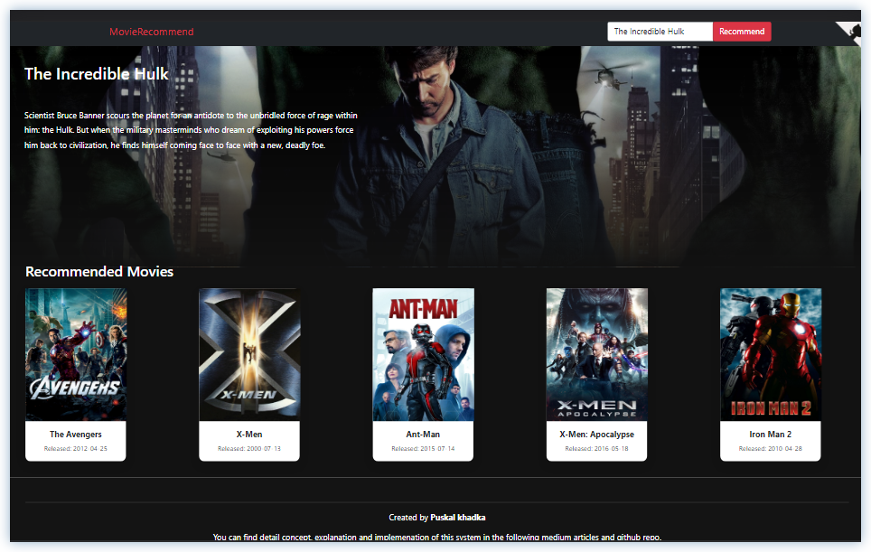

# Movie Recommendation System

Content based movie recommender engine built on Django using NLP (Natural Language Processing). This project also include jupyter notebook script which you can run directly incase if you don't know django.


## Demo

Live preview 
https://movierecommendationnlp.herokuapp.com/

 

## Installation

Clone this repository

```bash
 git clone https://github.com/puskal-khadka/MovieRecommendationSystem.git
```
    
Change directory
```bash
cd MovieRecommendationSystem
```

Install LFS (if you don't have)
```bash
git lfs install
```

Pull LFS
```bash
git lfs pull
```

Install dependencies (i recommend to do this stuff in virtual environment)
```bash
pip install -r requirements.txt
```

Run project
```bash
python manage.py runserver
```

Now our project deployed to local host, enter following address to view
```bash
http://127.0.0.1:8000/
```
## Contributing

Contributions are always welcome. Also if you have any
issue feel free to raise an issue.


